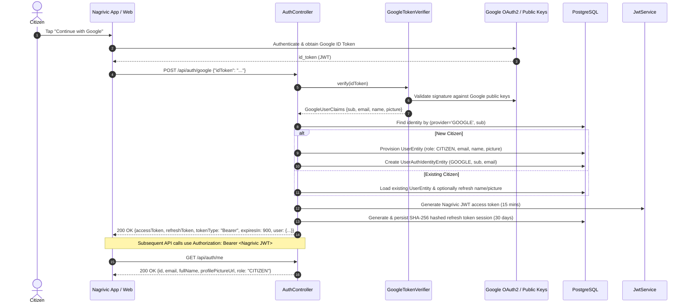

# Nagrivic Authentication Domain

## 1. Overview

Nagrivic provides a modern, secure, citizen-centric authentication foundation. **Google Sign-In is the PRIMARY citizen authentication method** across the React Native mobile app and Next.js public web app, eliminating password fatigue and SMS friction while providing cryptographically secure session management. Phone OTP authentication is retained in the backend for automated testing and secondary flows.

### Key Tenets
1. **Primary Authentication: Google Sign-In**: Citizens authenticate using Google on mobile and web. One Google account corresponds to one Nagrivic citizen account based on Google's immutable `sub` claim.
2. **Independent Cryptographic Verification**: The backend independently verifies Google ID tokens using Google's official API client (`com.google.api-client:google-api-client`), validating cryptographic signatures against Google public keys, issuers (`accounts.google.com` or `https://accounts.google.com`), audience allowlists (`nagrivic.auth.google.client-ids`), expiry, and safe identity claims. Client-supplied profile claims are never trusted blindly.
3. **Citizen Auto-Provisioning**: When a valid Google user signs in for the first time, a new `CITIZEN` account is automatically created in `users` with an associated `user_auth_identities` record. No SMS OTP or password is required.
4. **No Unlink/Merge Vulnerability**: If a Google email matches an existing phone-based user, accounts are never silently merged; the Google account links to its verified `sub` identity.
5. **Stateless Access Tokens (JWT)**: Short-lived HMAC-SHA256 signed JSON Web Tokens (15-minute default validity) carry identity and role claims.
6. **Opaque Refresh Token Sessions**: Long-lived (30-day default validity) refresh tokens are hashed using SHA-256 before storage in the database and rotated on each refresh.
7. **Secondary / Dev OTP Provider**: Phone OTP infrastructure (`send-otp`, `verify-otp`, `DevOtpProvider`) remains supported for automated tests and developer environments.

---

## 2. Database Schema

### `user_auth_identities` Table (`V25__create_user_auth_identities_and_make_phone_nullable.sql`)
Links external identity providers (Google) to Nagrivic citizen users.

| Column | Type | Constraints | Description |
|---|---|---|---|
| `id` | UUID | PRIMARY KEY | Unique identity record ID |
| `user_id` | UUID | NOT NULL, FK -> users(id) ON DELETE CASCADE | Associated Nagrivic user |
| `provider` | VARCHAR(32) | NOT NULL | Auth provider (e.g. `'GOOGLE'`) |
| `provider_subject` | VARCHAR(255) | NOT NULL | Immutable subject claim (`sub`) |
| `email` | VARCHAR(255) | NULL | Verified email address from provider |
| `created_at` | TIMESTAMP WITH TIME ZONE | NOT NULL | Identity link creation timestamp |

*Constraint*: `CONSTRAINT uq_user_auth_identities_provider_subject UNIQUE (provider, provider_subject)` ensures strict 1-to-1 account mapping and atomic concurrency safety.

### `users` Modifications (`V25`)
- `phone_number`: Made nullable (`DROP NOT NULL`) to support pure Google-authenticated citizens.
- `email`: `VARCHAR(255) NULL` for citizen email address.
- `profile_picture_url`: `VARCHAR(1024) NULL` for verified profile picture.

### `otp_verifications` Table (`V10__create_otp_verifications_table.sql`)
Stores temporary hashed OTP records with rate limiting and attempt counters.

| Column | Type | Constraints | Description |
|---|---|---|---|
| `id` | UUID | PRIMARY KEY | Unique identifier |
| `phone_number` | VARCHAR(15) | NOT NULL | Canonical normalized phone number |
| `otp_hash` | VARCHAR(255) | NOT NULL | BCrypt hashed 6-digit OTP |
| `purpose` | VARCHAR(32) | NOT NULL DEFAULT 'LOGIN' | 'LOGIN', 'SIGNUP', 'PHONE_CHANGE' |
| `expires_at` | TIMESTAMP WITH TIME ZONE | NOT NULL | Expiration timestamp (default +5m) |
| `attempts` | INTEGER | NOT NULL DEFAULT 0 | Failed verification count |
| `max_attempts` | INTEGER | NOT NULL DEFAULT 5 | Maximum allowed failed attempts |
| `consumed_at` | TIMESTAMP WITH TIME ZONE | NULL | Timestamp when successfully verified |
| `created_at` | TIMESTAMP WITH TIME ZONE | NOT NULL | Audit creation timestamp |

### `auth_sessions` Table (`V11__create_auth_sessions_table.sql`)
Maintains server-side session state for refresh tokens with rotation and revocation.

| Column | Type | Constraints | Description |
|---|---|---|---|
| `id` | UUID | PRIMARY KEY | Unique identifier |
| `user_id` | UUID | NOT NULL, FK -> users(id) ON DELETE CASCADE | Associated user reference |
| `refresh_token_hash` | VARCHAR(255) | NOT NULL, UNIQUE | SHA-256 hash of opaque token |
| `expires_at` | TIMESTAMP WITH TIME ZONE | NOT NULL | Expiration timestamp (default +30d) |
| `created_at` | TIMESTAMP WITH TIME ZONE | NOT NULL | Session creation timestamp |
| `revoked_at` | TIMESTAMP WITH TIME ZONE | NULL | Explicit revocation timestamp |
| `replaced_by_session_id`| UUID | NULL | Replaced session UUID on rotation |

---

## 3. Authentication Flow (Google Sign-In)



---

## 4. REST Endpoints

### 1. Google Sign-In / Sign-Up
- **URL**: `POST /api/auth/google`
- **Access**: Public
- **Request Body**:
```json
{
  "idToken": "eyJhbGciOiJSUzI1NiIsImtpZCI6..."
}
```
- **Response**: `200 OK`
```json
{
  "accessToken": "eyJhbGciOiJIUzI1NiIsInR5cCI6...",
  "refreshToken": "xYz123...",
  "tokenType": "Bearer",
  "expiresIn": 900,
  "user": {
    "id": "c1a2b3c4-...",
    "email": "citizen@example.com",
    "phoneNumber": null,
    "role": "CITIZEN",
    "fullName": "Jane Doe",
    "profilePictureUrl": "https://lh3.googleusercontent.com/..."
  }
}
```
- **Rate Limit**: Enforced per client IP (`nagrivic.moderation.rate-limit.google-auth-per-minute`).

### 2. Request OTP (Secondary / Test)
- **URL**: `POST /api/auth/send-otp`
- **Access**: Public
- **Request Body**:
```json
{
  "phoneNumber": "9876543210"
}
```
- **Response**: `200 OK`
```json
{
  "message": "OTP sent successfully to +919876543210",
  "expiresInSeconds": 300
}
```
- **Rate Limit**: 60-second cooldown between requests for the same phone number (`429 TOO_MANY_REQUESTS`).

### 3. Verify OTP (Secondary / Test)
- **URL**: `POST /api/auth/verify-otp`
- **Access**: Public
- **Request Body**:
```json
{
  "phoneNumber": "9876543210",
  "otp": "123456"
}
```
- **Response**: `200 OK`
```json
{
  "accessToken": "eyJhbGciOiJIUzI1NiIsInR5cCI6...",
  "refreshToken": "xYz123...",
  "tokenType": "Bearer",
  "expiresIn": 900,
  "user": {
    "id": "c1a2b3c4-...",
    "phoneNumber": "+919876543210",
    "role": "CITIZEN",
    "fullName": null
  }
}
```

### 4. Refresh Access Token
- **URL**: `POST /api/auth/refresh`
- **Access**: Public
- **Request Body**:
```json
{
  "refreshToken": "xYz123..."
}
```
- **Response**: `200 OK` (Rotates and returns a fresh access token and new refresh token).

### 5. Logout / Session Revocation
- **URL**: `POST /api/auth/logout`
- **Access**: Public / Authenticated
- **Request Body**:
```json
{
  "refreshToken": "xYz123..."
}
```
- **Response**: `200 OK {"message": "Logged out successfully"}`

### 6. Current User Profile
- **URL**: `GET /api/auth/me`
- **Access**: Authenticated (`Authorization: Bearer <accessToken>`)
- **Response**: `200 OK`
```json
{
  "id": "c1a2b3c4-...",
  "email": "citizen@example.com",
  "phoneNumber": null,
  "role": "CITIZEN",
  "fullName": "Jane Doe",
  "profilePictureUrl": "https://lh3.googleusercontent.com/..."
}
```

---

## 5. Security & Configuration Properties

In `application.yml`:
```yaml
nagrivic:
  auth:
    google:
      client-ids: ${GOOGLE_CLIENT_IDS:nagrivic-web-client-id,nagrivic-mobile-client-id}
    otp:
      provider: ${OTP_PROVIDER:DEV}
      expiration-minutes: ${OTP_EXPIRATION_MINUTES:5}
      cooldown-seconds: ${OTP_COOLDOWN_SECONDS:60}
      max-attempts: ${OTP_MAX_ATTEMPTS:5}
    jwt:
      secret: ${JWT_SECRET:nagrivic-default-dev-secret-key-that-is-at-least-256-bits-long-change-in-production}
      access-token-expiration-minutes: ${JWT_ACCESS_TOKEN_EXPIRATION_MINUTES:15}
      refresh-token-expiration-days: ${JWT_REFRESH_TOKEN_EXPIRATION_DAYS:30}
  moderation:
    rate-limit:
      google-auth-per-minute: ${GOOGLE_AUTH_RATE_LIMIT_PER_MINUTE:20}
```
