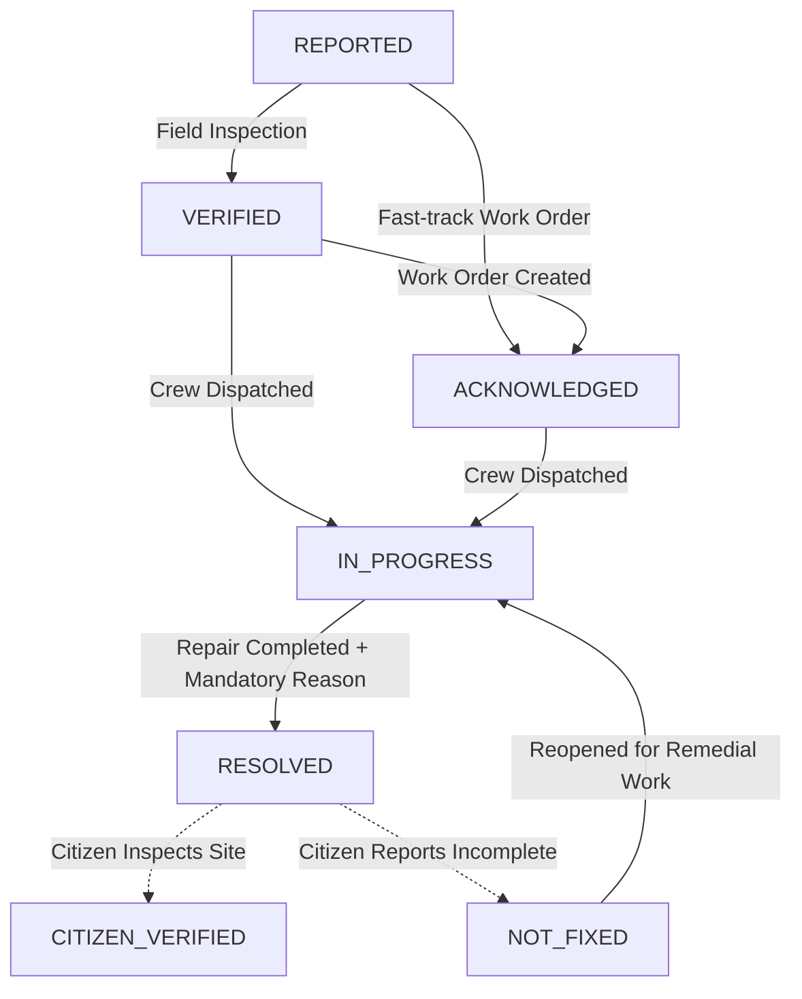

# Authority Issue Management & Operational Workflow Domain (`authorities`)

## 1. Domain Purpose & Philosophy

Nagrivic connects public civic reporting directly with accountable municipal operational teams. While citizens highlight defects in their physical surroundings and vote on priority, municipal authority officers and engineers are responsible for site inspection, departmental work orders, crew deployment, and repair execution.

The **Authority Issue Management & Operational Workflow Domain** establishes a secure, server-enforced operational portal for civic authorities (`ROLE_OFFICER` and `ROLE_ADMIN`).

### Key Principles

1. **Server-Enforced Jurisdictional Scoping**:
   - Authority officers can *only* inspect and operate on civic issues that fall within their actively assigned civic geography (Civic Body, City, Ward, Department, or Ward+Department combination).
   - Direct-access attacks (IDOR) via issue UUIDs outside an officer's assigned scope are strictly rejected by the server with `403 Forbidden`.
   - Issues with `UNRESOLVED` civic responsibility cannot be modified by authority officers until routing is resolved.
2. **Unified State Machine (No Parallel Workflows)**:
   - Authorities operate on the canonical `IssueStatus` state machine (`REPORTED`, `VERIFIED`, `ACKNOWLEDGED`, `IN_PROGRESS`, `RESOLVED`).
   - Authorities **cannot** mark an issue as `CITIZEN_VERIFIED` or `NOT_FIXED`. Resolution verification remains strictly the democratic prerogative of the reporting citizen.
3. **Audited Consequential Transitions**:
   - Marking an issue as `RESOLVED` mandates an operational explanation / resolution report describing actions taken.
   - All status transitions create immutable `status_history` and `issue_activity` timeline records attributing the acting officer.
4. **Optimistic Concurrency Control**:
   - To prevent multiple field officers from conflicting or overwriting concurrent actions, status updates enforce JPA `@Version` optimistic locking. Stale updates return `409 Conflict`.
5. **Strict Citizen Privacy Protection**:
   - Authority inspection DTOs never expose citizen phone numbers, private home addresses, or authentication secrets. Citizen comments display sanitized author initials and roles.

---

## 2. Authority Assignment & Scoping Model

### 2.1 Database Schema (`authority_assignments`)

Authority assignments associate an authenticated officer user with specific municipal jurisdictions:

```sql
CREATE TABLE authority_assignments (
    id UUID PRIMARY KEY DEFAULT gen_random_uuid(),
    user_id UUID NOT NULL REFERENCES users(id) ON DELETE CASCADE,
    civic_body_id UUID NOT NULL REFERENCES civic_bodies(id) ON DELETE RESTRICT_ON_DELETE,
    city_id UUID NOT NULL REFERENCES cities(id) ON DELETE RESTRICT_ON_DELETE,
    ward_id UUID REFERENCES wards(id) ON DELETE SET NULL,
    department_id UUID REFERENCES departments(id) ON DELETE SET NULL,
    designation VARCHAR(120),
    is_active BOOLEAN NOT NULL DEFAULT true,
    created_at TIMESTAMPTZ NOT NULL DEFAULT NOW(),
    updated_at TIMESTAMPTZ NOT NULL DEFAULT NOW(),
    version BIGINT NOT NULL DEFAULT 0
);
```

### 2.2 Scoping Logic Matrix

| Assignment Level | Ward | Department | Accessible Issues |
|---|:---:|:---:|---|
| **Ward Officer** | Ward A | *null* | All resolved issues located in Ward A across any department |
| **Department Engineer** | *null* | Dept X | All resolved issues assigned to Dept X across any ward in the city |
| **Ward Department Specialist** | Ward A | Dept X | Resolved issues located in Ward A *and* assigned to Dept X |
| **Civic Body / City Executive** | *null* | *null* | All resolved issues within the assigned civic body / city |
| **Global Administrator (`ROLE_ADMIN`)** | *Any* | *Any* | All resolved civic issues nationwide across any authority |

---

## 3. Operational Workflow & Allowed State Transitions

Authorities participate in the operational lifecycle of an issue:



### Transition Enforcement Rules

- **Allowed Target Statuses for Authorities**: `VERIFIED`, `ACKNOWLEDGED`, `IN_PROGRESS`, `RESOLVED`.
- **Forbidden Target Statuses for Authorities**: `CITIZEN_VERIFIED`, `NOT_FIXED` (returns `403 Forbidden`).
- **Resolution Mandatory Reason**: When target status is `RESOLVED`, a non-empty explanation (up to 1,000 characters) is strictly required.

---

## 4. REST API Reference

Base path: `/api/authority` (Requires `ROLE_OFFICER` or `ROLE_ADMIN`)

### 4.1 Get Authority Dashboard Metrics
- **Endpoint**: `GET /api/authority/dashboard`
- **Response**: `200 OK`
  ```json
  {
    "totalScopedIssues": 42,
    "reportedCount": 8,
    "verifiedCount": 12,
    "acknowledgedCount": 6,
    "inProgressCount": 10,
    "resolvedCount": 6,
    "citizenVerifiedCount": 15,
    "notFixedCount": 2,
    "highPriorityCount": 9,
    "criticalPriorityCount": 3,
    "actionableCount": 38,
    "assignedScopes": [
      {
        "id": "c1f7a01a-...",
        "civicBodyName": "Ahmedabad Municipal Corporation",
        "cityName": "Ahmedabad",
        "wardName": "Navrangpura",
        "wardNumber": "014",
        "designation": "Ward Inspector"
      }
    ]
  }
  ```

### 4.2 Query Scoped Issues List
- **Endpoint**: `GET /api/authority/issues`
- **Query Parameters**:
  - `status` (`IssueStatus`, optional)
  - `priority` (`PriorityLevel`, optional)
  - `wardId` (`UUID`, optional)
  - `departmentId` (`UUID`, optional)
  - `actionableOnly` (`boolean`, optional - filters for `REPORTED`, `VERIFIED`, `ACKNOWLEDGED`, `IN_PROGRESS`, `NOT_FIXED`)
  - `search` (`string`, optional)
  - `page` (`number`, default 0)
  - `size` (`number`, default 20)
- **Response**: `200 OK` with Spring `Page<AuthorityIssueItemResponse>`.

### 4.3 Get Scoped Issue Detail
- **Endpoint**: `GET /api/authority/issues/{issueId}`
- **Security**: Verifies that the authenticated officer user has an active authority assignment covering the issue's ward/department. Returns `403 Forbidden` if out of scope.
- **Response**: `200 OK` (`AuthorityIssueDetailResponse`).
  - Includes `allowedTransitions` array indicating legal next state machine transitions.
  - Includes `version` (optimistic locking counter).
  - Sanitized citizen comments (`authorRole`, `authorInitials`, no PII).

### 4.4 Execute Operational Status Transition
- **Endpoint**: `POST /api/authority/issues/{issueId}/status`
- **Request Body**:
  ```json
  {
    "status": "RESOLVED",
    "reason": "Road repaved with hot-mix asphalt and opened to traffic.",
    "version": 2
  }
  ```
- **Responses**:
  - `200 OK`: Transition successful, returns updated `IssueResponse`.
  - `400 Bad Request`: Illegal state jump or missing mandatory reason for `RESOLVED`.
  - `403 Forbidden`: User lacks scope authority or attempted to mark `CITIZEN_VERIFIED`.
  - `409 Conflict`: Stale `version` detected (optimistic locking collision).

### 4.5 Attach Resolution Evidence
- **Endpoint**: `POST /api/authority/issues/{issueId}/resolution-evidence`
- **Security**: Verifies that the authenticated officer user has an active authority assignment covering the issue's ward/department. Returns `403 Forbidden` if out of scope.
- **Request**: `multipart/form-data` with `evidenceType` (`COMPLETION_PHOTO`, `COMPLETION_NOTE`, `BEFORE_AFTER_PHOTO`), optional `file` (image <= 10MB), optional `note` (max 1000 chars), optional `capturedAt`.
- **State Enforcement**: Allowed only for `IN_PROGRESS` or `RESOLVED` issues; rejects other statuses with `400 Bad Request`.
- **Response**: `201 Created` with `ResolutionEvidenceResponse`.

---

## 5. Web Frontend Architecture

- **Layout & Access Control** (`web/app/authority/layout.tsx`):
  - Enforces `OFFICER` or `ADMIN` roles. Non-authority users receive an "Access Restricted" view.
- **Dashboard Overview** (`web/app/authority/page.tsx`):
  - Displays jurisdictional scopes, metric cards, and actionable queues.
- **Scoped Issue Queue** (`web/app/authority/issues/page.tsx`):
  - Multi-filter controls, actionable-only toggle, pagination, and priority/status chips.
- **Issue Detail & Workflow Execution** (`web/app/authority/issues/[issueId]/page.tsx`):
  - IDOR access-denied banner if out of scope.
  - Dynamic transition buttons according to `allowedTransitions`.
  - Confirmation modal with 1,000-character resolution report counter.
  - Optimistic locking collision handling (`ConcurrencyConflictError` on 409) with auto-reload.
  - Resolution Evidence gallery displaying uploaded completion photos, before/after evidence, and operational notes.
  - Evidence upload modal allowing officers to upload photo evidence (up to 10MB) or add field notes with captured timestamps.
  - Pre-resolution recommendation banner advising officers to attach evidence before marking an issue `RESOLVED`.
