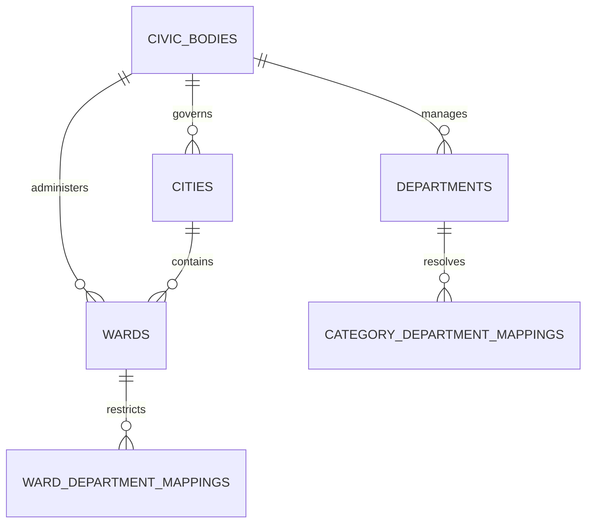

# Civic Geography & Ward Boundary Architecture

## 1. Domain Purpose & Philosophy

Nagrivic grounds civic issue reporting in real-world administrative geography. When a citizen reports a physical problem—such as an unlit road junction or an overflowing sewage line—the system must determine the governing administrative jurisdiction:

$$\text{State} \longrightarrow \text{City} \longrightarrow \text{Civic Body} \longrightarrow \text{Ward (Boundary Polygon)} \longrightarrow \text{Responsible Department}$$

### Foundational Principles
1. **Evidence-Based Spatial Identification**: Ward mapping uses PostGIS point-in-polygon queries (`ST_Contains`) evaluated against authoritative boundary polygons (`geometry(MultiPolygon, 4326)`).
2. **Never Guess / No Centroid Proximity**: If a geographic point falls outside all mapped ward boundaries (or boundary data is not yet loaded), the location remains **unresolved** (`null`). The platform never guesses or computes proximity to arbitrary ward centers.
3. **Non-blocking Issue Reporting**: Civic reporting must never fail or be rejected because municipal geography data is missing or incomplete. Unmapped issues are accepted normally and can be assigned as boundaries become available.
4. **Server-Controlled Administrative Mappings**: The client (mobile or web) is never allowed to specify or tamper with `wardId`, `cityId`, `civicBodyId`, or `departmentId`. These are derived server-side from spatial geometry and configured mappings.
5. **Data Provenance**: Every administrative boundary and governing body record maintains audit provenance fields: `source`, `source_url`, and `last_verified_at`.
6. **Decoupled Dynamic Resolution**: Issues resolve civic area dynamically via `CivicGeographyService`. This protects against data drift during municipal ward redistricting and keeps the `issues` table lean.

---

## 2. Relational Schema & Spatial Data Model

Defined in Flyway migration `V17__create_civic_geography_tables.sql`:



### 2.1 Civic Bodies (`civic_bodies`)
Represents the local urban self-governing authority (e.g., Ahmedabad Municipal Corporation - AMC).

| Column | Type | Constraints | Description |
|---|---|---|---|
| `id` | `UUID` | `PRIMARY KEY` | Globally unique identifier (UUIDv4). |
| `name` | `VARCHAR(255)` | `NOT NULL` | Official name (e.g., "Ahmedabad Municipal Corporation"). |
| `type` | `VARCHAR(50)` | `NOT NULL` | `MUNICIPAL_CORPORATION`, `MUNICIPALITY`, `NAGAR_PANCHAYAT`, `OTHER`. |
| `state` | `VARCHAR(100)` | `NOT NULL` | State (e.g., "Gujarat"). |
| `city` | `VARCHAR(100)` | `NOT NULL` | City name. |
| `official_website`| `VARCHAR(255)` | `NULL` | Public portal URL. |
| `source` | `VARCHAR(255)` | `NULL` | Provenance data source description. |
| `source_url` | `VARCHAR(500)` | `NULL` | URL of authoritative source document. |
| `last_verified_at`| `TIMESTAMPTZ` | `NULL` | Timestamp of last provenance verification. |
| `is_active` | `BOOLEAN` | `NOT NULL DEFAULT TRUE` | Administrative status flag. |

### 2.2 Cities (`cities`)
Represents urban geographical areas within states.

| Column | Type | Constraints | Description |
|---|---|---|---|
| `id` | `UUID` | `PRIMARY KEY` | Globally unique identifier (UUIDv4). |
| `name` | `VARCHAR(100)` | `NOT NULL` | City name (e.g., "Ahmedabad"). |
| `state` | `VARCHAR(100)` | `NOT NULL` | State (e.g., "Gujarat"). |
| `country_code` | `VARCHAR(10)` | `NOT NULL DEFAULT 'IN'` | ISO country code. |
| `civic_body_id`| `UUID` | `FK -> civic_bodies(id) ON DELETE SET NULL` | Governing civic body. |
| `is_active` | `BOOLEAN` | `NOT NULL DEFAULT TRUE` | Active status flag. |

*Unique Constraint*: `CONSTRAINT uq_cities_name_state UNIQUE (name, state)`.

### 2.3 Wards (`wards`)
Administrative electoral and operational subunits within a city.

| Column | Type | Constraints | Description |
|---|---|---|---|
| `id` | `UUID` | `PRIMARY KEY` | Globally unique identifier (UUIDv4). |
| `city_id` | `UUID` | `FK -> cities(id) ON DELETE RESTRICT` | Associated city. |
| `civic_body_id`| `UUID` | `FK -> civic_bodies(id) ON DELETE SET NULL` | Governing civic body. |
| `ward_number` | `VARCHAR(50)` | `NULL` | Official ward number (e.g., "12"). |
| `ward_name` | `VARCHAR(255)` | `NOT NULL` | Human-readable ward name (e.g., "Navrangpura"). |
| `ward_code` | `VARCHAR(50)` | `NULL` | Official administrative code (e.g., "AMC-W12"). |
| `boundary_geometry` | `geometry(MultiPolygon, 4326)` | `NULL` | Authoritative PostGIS boundary MultiPolygon in WGS 84. |
| `source` | `VARCHAR(255)` | `NULL` | Shapefile / GeoJSON boundary source provenance. |
| `source_url` | `VARCHAR(500)` | `NULL` | Official portal URL. |
| `last_verified_at`| `TIMESTAMPTZ` | `NULL` | Timestamp of last provenance verification. |
| `is_active` | `BOOLEAN` | `NOT NULL DEFAULT TRUE` | Active status flag. |

*Spatial Index*: `CREATE INDEX idx_wards_boundary_geom ON wards USING GIST(boundary_geometry);`

---

## 3. PostGIS Point-in-Polygon Resolution

Ward identification is executed directly in the database engine using the GiST spatial index. The application **never** loads all wards into memory to evaluate point-in-polygon calculations.

### Native PostGIS Query
```sql
SELECT w.id FROM wards w
WHERE w.is_active = true
  AND w.boundary_geometry IS NOT NULL
  AND ST_Contains(w.boundary_geometry, ST_SetSRID(ST_MakePoint(:lon, :lat), 4326))
LIMIT 1;
```

- `ST_MakePoint(:lon, :lat)`: Constructs the point coordinate (`X=longitude, Y=latitude`).
- `ST_SetSRID(..., 4326)`: Assigns WGS 84 spatial reference system.
- `ST_Contains(...)`: Evaluates spatial containment, accelerated by the GiST R-tree index.

---

## 4. Public Issue Response Contract (`civicArea`)

When mapping data is available, public issue responses (`IssueResponse`) expose safe, curated administrative summaries:

```json
{
  "id": "e4b85c18-936d-4952-ba13-180b726cf9c0",
  "title": "Deep pothole near university crossroad",
  "status": "REPORTED",
  "civicArea": {
    "city": "Ahmedabad",
    "ward": {
      "name": "Navrangpura",
      "number": "12"
    },
    "civicBody": {
      "name": "Ahmedabad Municipal Corporation"
    },
    "department": {
      "name": "Roads & Buildings"
    }
  }
}
```

### Privacy & Data Minimization Rules
- **No Internal IDs**: Ward, civic body, or department internal database primary keys are omitted from the public summary.
- **No Private Contacts**: Official employee personal phone numbers, emails, or credentials are strictly excluded.
- **Graceful Null**: If the coordinate lies outside mapped boundaries, `"civicArea": null`.

---

## 5. Issue Civic Responsibility Enrichment Layer (Task 19)

### 5.1 Architecture & Flow
When an authenticated citizen creates an issue, the backend executes the server-controlled Civic Responsibility Enrichment process:

```
Issue Location
      ↓
City Resolution
      ↓
Ward Resolution (PostGIS point-in-polygon)
      ↓
Civic Body Resolution
      ↓
Department Mapping & Precedence Resolution
      ↓
Persist Snapshot: RESOLVED / UNRESOLVED
```

### 5.2 "Unresolved Does Not Mean Invalid"
A fundamental design principle of Nagrivic:
> **"Unresolved does not mean invalid."**

If authoritative geography or department mapping data is missing:
- Issue creation remains completely successful.
- The issue is preserved and marked with `responsibility_status = 'UNRESOLVED'`.
- Missing ward boundaries or unmapped departments never throw a 500 or block citizen reports.
- Server-controlled enrichment re-runs idempotently when authoritative mapping data is imported.

### 5.3 Database Schema Persistence on `issues` (Flyway `V18`)
Task 19 establishes server-controlled responsibility persistence on the `issues` table:
- `civic_body_id UUID NULL REFERENCES civic_bodies(id) ON DELETE SET NULL`
- `city_id UUID NULL REFERENCES cities(id) ON DELETE SET NULL`
- `ward_id UUID NULL REFERENCES wards(id) ON DELETE SET NULL`
- `department_id UUID NULL REFERENCES departments(id) ON DELETE SET NULL`
- `responsibility_status VARCHAR(30) NOT NULL DEFAULT 'UNRESOLVED'`
- `responsibility_resolved_at TIMESTAMPTZ NULL`
- `responsibility_source VARCHAR(255) NULL`

### 5.4 Mapping Precedence Rules
Department resolution implements a strict, deterministic precedence strategy:
1. **Civic Body Scoping**: Departments must belong to the resolved `CivicBody` and be active.
2. **Specific Authoritative Mapping (Ward Precedence)**: If active `ward_department_mappings` exist for the containing ward, candidate departments are filtered to those specifically active for that ward.
   - If exactly one ward-specific department matches the issue category, it takes precedence and resolves.
   - If multiple ward-specific mappings match, it is treated as a conflict $\rightarrow$ `UNRESOLVED` (no guessing).
3. **Broader Category-Level Mapping**: If no ward-specific specialization exists, candidate departments at the civic-body level are evaluated.
   - If exactly one department matches, it resolves deterministically.
   - If multiple conflicting candidate departments match without ward disambiguation $\rightarrow$ `UNRESOLVED` (no arbitrary choices; diagnostic logged).

### 5.5 Public API Contract (`civicResponsibility`)
Exposed via `GET /api/issues/{id}` and `GET /api/issues`:

**Resolved State**:
```json
"civicResponsibility": {
  "status": "RESOLVED",
  "civicBody": {
    "id": "76495b54-9721-4f10-b962-e64e5c4642ab",
    "name": "Ahmedabad Municipal Corporation"
  },
  "city": {
    "id": "e305e9ea-1941-4c60-aee8-bcdd4e55e8eb",
    "name": "Ahmedabad"
  },
  "ward": {
    "id": "18f98ec4-eef7-47b2-bd7b-f9d266e7456d",
    "name": "Navrangpura"
  },
  "department": {
    "id": "060d4023-e28e-49b4-93ec-e170c1e095fe",
    "name": "Roads & Buildings"
  }
}
```

**Unresolved State**:
```json
"civicResponsibility": {
  "status": "UNRESOLVED",
  "civicBody": null,
  "city": null,
  "ward": null,
  "department": null
}
```

### 5.6 Re-Resolution Support
The internal service operation `IssueResponsibilityService.resolveIssueResponsibility(UUID issueId)` evaluates existing issues against new ward boundaries or department mappings. It is idempotent, deterministic, and safe to execute periodically.

---

## 6. Ahmedabad Pilot Strategy

Nagrivic launches in Ahmedabad with the Ahmedabad Municipal Corporation (AMC).
- **No Hardcoded Polygons in Code**: Ward boundary coordinates are not hardcoded in Java classes.
- **No Scraped Data**: Production boundary data must come exclusively from verified, authoritative open government sources (e.g. AMC GIS portal, Census of India administrative maps).
- **Seed Fixtures**: Minimal test fixtures are strictly isolated in automated tests and marked as development fixtures.

---

## 7. Administrative Management System (Task 41)

Task 41 establishes a secure administrative management subsystem for Nagrivic's civic geography and responsibility configurations under the privileged namespace `/api/admin/geography/**`.

### 7.1 Security & Role Model
- **ADMIN-Only Access**: Full mutation and management capabilities (`@PreAuthorize("hasRole('ADMIN')")`).
- **CITIZEN & MODERATOR Denied**: Regular citizens and content moderators receive `HTTP 403 Forbidden` for geography endpoints.
- **Server-Derived Identity**: The mutating actor's UUID is derived strictly from the authenticated Spring Security `Authentication` token (`UserEntity.getId()`). Client-supplied actor IDs are forbidden.

### 7.2 Safety & Deactivation Rules
- **No Hard-Deletion of Referenced Entities**: Entities (civic bodies, cities, wards, departments, mappings) referenced by historical issues cannot be deleted (`HTTP 409 Conflict`).
- **Safe Active/Inactive Toggling**: Administrative actions prefer `isActive = false` to preserve referential integrity and historical accountability.
- **Historical Immutability**: Modifying a mapping never mutates historical issue responsibility records retroactively. Re-resolution is explicit and bounded.

### 7.3 Concurrency Protection (Optimistic Locking)
- All civic geography tables include `@Version Long version` managed by JPA.
- Every administrative update or state change validates the submitted version against the current database state.
- Stale version updates throw `ObjectOptimisticLockingFailureException`, which is caught and returned as `HTTP 409 Conflict`.

### 7.4 Append-Only Audit Trail
- All administrative geography mutations generate immutable, append-only records in `civic_geography_audits`.
- Captures `actor_id`, `entity_type`, `entity_id`, `action`, `previous_state`, `new_state`, `reason`, `source`, `source_url`, and `created_at`.
- Historical audit records cannot be altered or deleted via the API.

### 7.5 Bounded Responsibility Re-Resolution
- Privileged endpoint `POST /api/admin/geography/re-resolve` safely triggers the responsibility resolver for existing issues in bounded batches (max limit: 100).
- Re-resolution alters only civic responsibility fields (`civic_body_id`, `city_id`, `ward_id`, `department_id`, `responsibility_status`, `responsibility_resolved_at`, `responsibility_source`). It never mutates issue workflow status, priority, reporter identity, or citizen comments.

