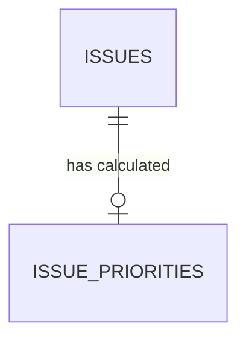

# Issue Priority & Civic Impact Foundation

## 1. Domain Purpose & Philosophy

Nagrivic is a civic issue reporting and accountability platform. Its core mission is to help municipal bodies, field officers, and citizens understand which civic problems require immediate attention and which can follow routine maintenance schedules.

To achieve this responsibly, Nagrivic establishes a transparent, multi-dimensional **civic impact scoring engine**:

$$\text{Priority Score } (0-100) = \text{Severity } (0-30) + \text{Public Impact } (0-25) + \text{Safety Impact } (0-25) + \text{Age } (0-10) + \text{Support } (0-10)$$

---

## 2. Foundational Principles

### 2.1 Support Count $\neq$ Priority
In pure social platforms, upvotes determine visibility. **Civic governance cannot operate this way.**
- A minor aesthetic issue (e.g., chipped paint or overgrown grass in a popular park) with 1,000 upvotes must **never** overshadow an unlit road intersection or open high-voltage cable that has only 1 report and 0 supports.
- To prevent popularity brigading, **support contribution is strictly capped at a maximum of 10 points out of 100**.
- Physical safety hazards contribute up to 55 points independently (`severity` up to 30 + `safety_impact` up to 25), ensuring critical hazards naturally rise to HIGH or CRITICAL priority bands regardless of public support count.

### 2.2 Server-Controlled Calculation & Anti-Spoofing
- The priority score and priority level are **strictly calculated server-side**.
- Clients cannot choose priority, override component scores, or inject custom values.
- When creating an issue, `CreateIssueRequest` accepts an optional advisory `severity` field (`LOW`, `MEDIUM`, `HIGH`, `CRITICAL`) which the server treats as an advisory signal only. All other score components are evaluated server-side.

### 2.3 Canonical Duplicate Handling
- Duplicate issues point to a single canonical issue (`duplicate_of_issue_id`).
- Priority records are associated **only with the canonical issue** (`issue_id UNIQUE`).
- If priority calculation is triggered for a duplicate issue, the engine automatically resolves the canonical issue and calculates priority for that canonical issue.

### 2.4 Internal Heuristic Disclaimer
> [!NOTE]
> Priority scores and levels are **internal heuristic recommendations** computed by Nagrivic to assist municipal officers in triage and workflow management. They do **not** represent official government SLAs, statutory timelines, or legal guarantees.

---

## 3. Priority Scoring Model & Bands

### 3.1 Component Breakdown (Total 0–100)

| Component | Max Points | Formula / Scale | Explanation |
|---|---|---|---|
| **Severity** | **30** | `LOW` (5), `MEDIUM` (15), `HIGH` (25), `CRITICAL` (30) | Physical scale and immediate destructiveness of the defect. |
| **Public Impact** | **25** | `LOW` (5), `MEDIUM` (15), `HIGH` (25) | Scope of public affected (neighborhood street vs. arterial highway / main junction). |
| **Safety Impact** | **25** | `NONE` (0), `LOW` (5), `MEDIUM` (15), `HIGH` (20), `CRITICAL` (25) | Risk of physical injury, electrocution, road accidents, or health hazards. |
| **Age** | **10** | $<2\text{d}$ (0), $2\text{–}7\text{d}$ (2), $8\text{–}30\text{d}$ (5), $31\text{–}90\text{d}$ (8), $>90\text{d}$ (10) | Time elapsed since issue reporting without resolution. Escalates neglected issues. |
| **Support** | **10** | $0$ (0), $1\text{–}2$ (2), $3\text{–}5$ (4), $6\text{–}10$ (6), $11\text{–}20$ (8), $>20$ (10) | Capped civic corroboration signal. |

### 3.2 Priority Level Bands

| Band Range | Priority Level | Triage Description |
|---|---|---|
| **0 – 24** | `LOW` | Minor aesthetic defects, routine non-urgent maintenance. |
| **25 – 49** | `MEDIUM` | Standard civic inconveniences with moderate localized impact. |
| **50 – 74** | `HIGH` | Serious service disruptions or hazards affecting significant public movement. |
| **75 – 100** | `CRITICAL` | Severe life safety hazards, arterial road cave-ins, or major infrastructure failures. |

---

## 4. Relational Schema & Database Design

Defined in Flyway migration `V19__create_issue_priorities_table.sql`:



### Table: `issue_priorities`

| Column | Type | Constraints | Description |
|---|---|---|---|
| `id` | `UUID` | `PRIMARY KEY` | UUIDv4 identifier. |
| `issue_id` | `UUID` | `NOT NULL UNIQUE REFERENCES issues(id) ON DELETE CASCADE` | Exactly one priority record per canonical issue. |
| `priority_level` | `VARCHAR(20)` | `NOT NULL CHECK in (LOW, MEDIUM, HIGH, CRITICAL)` | Calculated categorical band. |
| `score` | `INT` | `NOT NULL CHECK (score BETWEEN 0 AND 100)` | Total composite score. |
| `severity_score` | `INT` | `NOT NULL CHECK (severity_score BETWEEN 0 AND 30)` | Severity component contribution. |
| `impact_score` | `INT` | `NOT NULL CHECK (impact_score BETWEEN 0 AND 25)` | Public impact component contribution. |
| `safety_score` | `INT` | `NOT NULL CHECK (safety_score BETWEEN 0 AND 25)` | Safety impact component contribution. |
| `age_score` | `INT` | `NOT NULL CHECK (age_score BETWEEN 0 AND 10)` | Aging component contribution. |
| `support_score` | `INT` | `NOT NULL CHECK (support_score BETWEEN 0 AND 10)` | Support count contribution (strictly capped). |
| `calculation_version` | `VARCHAR(20)` | `NOT NULL DEFAULT 'v1'` | Engine version identifier for future auditability. |
| `calculated_at` | `TIMESTAMPTZ` | `NOT NULL` | Timestamp when score was last recalculated. |

### Indexes
- `idx_issue_priorities_issue_id` on `issue_id`
- `idx_issue_priorities_level` on `priority_level`
- `idx_issue_priorities_score` on `score DESC`

---

## 5. Recalculation Lifecycle Triggers

Priority is automatically recalculated at key lifecycle moments:
1. **Issue Creation (`IssueService.createIssue`)**:
   Initial priority is computed immediately upon issue creation and stored.
2. **Support Added (`SupportService.addSupport`)**:
   Adding a citizen support triggers priority recalculation on the canonical issue.
3. **Support Removed (`SupportService.removeSupport`)**:
   Removing support triggers recalculation.
4. **Status Workflow (`StatusHistoryService.changeStatus` & `verifyResolution`)**:
   - Status changes update issue state.
   - When a citizen verifies an issue was `NOT_FIXED`, the issue reactivates and recalculates priority, accounting for cumulative age and current support.
   - When an issue reaches `RESOLVED` or `CITIZEN_VERIFIED`, historical priority remains preserved in the database for post-resolution reporting.

---

## 6. API Contracts

### 6.1 Priority Representation in Issue Responses

Whenever an issue is returned (`GET /api/issues/{id}`, `GET /api/issues`, `POST /api/issues`), the `priority` object is included:

```json
{
  "id": "7b79d20c-8e47-4934-8c85-2e1858021c43",
  "title": "Severe road cave-in on SG Highway",
  "status": "REPORTED",
  "priority": {
    "level": "HIGH",
    "score": 67,
    "severityScore": 25,
    "impactScore": 15,
    "safetyScore": 20,
    "ageScore": 5,
    "supportScore": 2,
    "calculationVersion": "v1",
    "calculatedAt": "2026-09-11T17:40:00Z"
  }
}
```

### 6.2 Filtering Issues by Priority Level

Query parameter: `GET /api/issues?priority=HIGH` (or `LOW`, `MEDIUM`, `CRITICAL`).
The backend joins `issue.priority` and applies the filter at the database level with zero N+1 overhead.

---

## 7. AI Priority Assistance (Task 48)

To assist municipal authorities during operational triage, Task 48 introduces an AI advisory recommendation layer.
- **Authoritative Foundation**: The deterministic formula above remains authoritative.
- **Default Mode (`ADVISORY`)**: AI recommendations are displayed in authority dashboards without altering deterministic scores.
- **Optional `BLENDED` Mode**: Provides bounded adjustments capped strictly at max $\pm 10$ points overall ($\pm 5$ severity, $\pm 4$ impact, $\pm 4$ safety). Age and support are **never** altered by AI.
- **Anti-CRITICAL Safeguard**: AI alone can never escalate an issue into `CRITICAL` (score $\ge 75$). A baseline below 75 is strictly capped at 74 (`HIGH` maximum).

For complete technical specifications, mathematical blending formulas, and zero-PII safeguards, refer to [AI Priority Assistance](file:///j:/Nagrivic/docs/domains/ai-priority.md).

