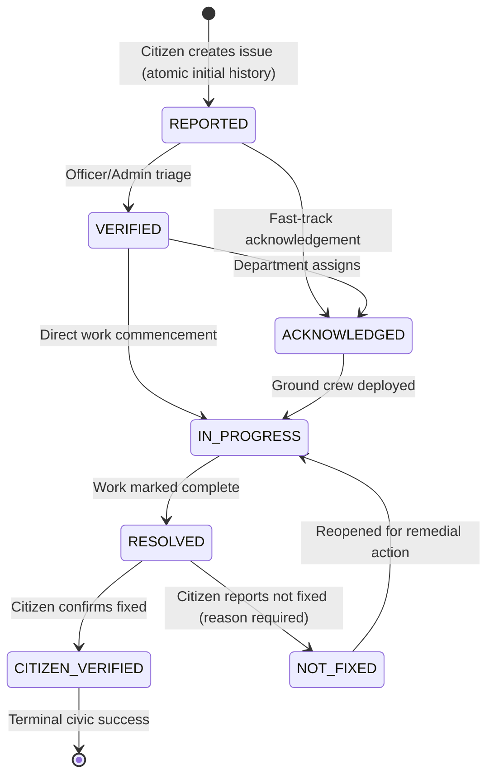

# Issue Status & Resolution Workflow Domain (`status_history`)

## 1. Domain Purpose & Philosophy

The lifecycle of a civic issue represents the core accountability loop between citizens and urban local bodies. In many municipal systems, issues are either silently ignored or prematurely marked "resolved" on paper without real-world rectification. 

Nagrivic solves this through a strictly enforced, auditable, and citizen-verifiable status workflow:

1. **State Machine Integrity**: Only well-defined, valid state transitions are permitted. Arbitrary jumps across stages are rejected by the domain engine.
2. **Immutable Audit Trail**: Every status transition—including the initial creation of an issue—appends an immutable record to `status_history`. Status history cannot be modified or deleted.
3. **Optimistic Locking**: Concurrent updates to issue status are guarded via JPA optimistic locking (`version` column), preventing lost updates or race conditions.
4. **Role-Based Authorization**: Operational transitions (`REPORTED -> VERIFIED -> ACKNOWLEDGED -> IN_PROGRESS -> RESOLVED`) require elevated administrative or officer privileges (`ROLE_OFFICER` or `ROLE_ADMIN`). Ordinary citizens cannot arbitrarily manipulate civic statuses.
5. **Citizen Resolution Verification**: When an issue is marked `RESOLVED`, the original reporting citizen holds the power to verify whether the physical defect was genuinely resolved (`CITIZEN_VERIFIED`) or reject the resolution (`NOT_FIXED`), automatically reopening the workflow to `IN_PROGRESS`.
6. **Public Transparency & Privacy**: The full chronological history is publicly queryable by citizens without authentication, with strict masking of sensitive administrative or reporter credentials (no phone numbers, passwords, or tokens are ever exposed).

---

## 2. State Machine & Transition Matrix

### 2.1 Supported Issue Statuses

| Status | Code | Description | Who Can Set |
|---|---|---|---|
| `REPORTED` | `REPORTED` | Issue reported by a citizen and queued for triage. | System (on issue creation) |
| `VERIFIED` | `VERIFIED` | Field inspection or moderator confirmed the issue exists and is genuine. | Officer / Admin |
| `ACKNOWLEDGED` | `ACKNOWLEDGED` | Assigned municipal department acknowledged responsibility. | Officer / Admin |
| `IN_PROGRESS` | `IN_PROGRESS` | Active repair or maintenance work has commenced on site. | Officer / Admin |
| `RESOLVED` | `RESOLVED` | Field authority reports the physical work is complete. | Officer / Admin |
| `CITIZEN_VERIFIED`| `CITIZEN_VERIFIED` | Original reporting citizen inspected the site and confirmed successful fix. | Original Reporter |
| `NOT_FIXED` | `NOT_FIXED` | Original reporting citizen inspected the site and reported work is inadequate or incomplete. | Original Reporter |

### 2.2 Lifecycle State Diagram



### 2.3 Transition Validation Matrix

| From \ To | `REPORTED` | `VERIFIED` | `ACKNOWLEDGED` | `IN_PROGRESS` | `RESOLVED` | `CITIZEN_VERIFIED` | `NOT_FIXED` |
|---|:---:|:---:|:---:|:---:|:---:|:---:|:---:|
| `REPORTED` | - | **Yes** | **Yes** | No | No | No | No |
| `VERIFIED` | No | - | **Yes** | **Yes** | No | No | No |
| `ACKNOWLEDGED` | No | No | - | **Yes** | No | No | No |
| `IN_PROGRESS` | No | No | No | - | **Yes** | No | No |
| `RESOLVED` | No | No | No | No | - | **Yes** | **Yes** |
| `NOT_FIXED` | No | No | No | **Yes** | No | - | No |
| `CITIZEN_VERIFIED`| No | No | No | No | No | No | - |

Any attempt to execute a transition not marked **Yes** results in a `400 Bad Request` with error code `INVALID_STATUS_TRANSITION`.

---

## 3. Database Schema (`status_history`)

Defined in Flyway migration `V16__create_status_history_table.sql`:

```sql
CREATE TABLE status_history (
    id UUID PRIMARY KEY,
    issue_id UUID NOT NULL,
    from_status VARCHAR(30) NULL,
    to_status VARCHAR(30) NOT NULL,
    changed_by_user_id UUID NULL,
    reason TEXT NULL,
    created_at TIMESTAMPTZ NOT NULL DEFAULT NOW(),
    CONSTRAINT fk_status_history_issue_id FOREIGN KEY (issue_id) REFERENCES issues(id) ON DELETE CASCADE,
    CONSTRAINT fk_status_history_user_id FOREIGN KEY (changed_by_user_id) REFERENCES users(id) ON DELETE SET NULL,
    CONSTRAINT chk_status_history_from_status CHECK (
        from_status IS NULL OR from_status IN (
            'REPORTED', 'VERIFIED', 'ACKNOWLEDGED', 'IN_PROGRESS', 'RESOLVED', 'CITIZEN_VERIFIED', 'NOT_FIXED'
        )
    ),
    CONSTRAINT chk_status_history_to_status CHECK (
        to_status IN (
            'REPORTED', 'VERIFIED', 'ACKNOWLEDGED', 'IN_PROGRESS', 'RESOLVED', 'CITIZEN_VERIFIED', 'NOT_FIXED'
        )
    )
);

CREATE INDEX idx_status_history_issue_created ON status_history(issue_id, created_at ASC);
CREATE INDEX idx_status_history_user ON status_history(changed_by_user_id);

ALTER TABLE issues ADD COLUMN IF NOT EXISTS version BIGINT NOT NULL DEFAULT 0;
```

### Key Schema Characteristics
1. **Append-Only Immutability**: There are no update or delete operations on `status_history`.
2. **Nullable `from_status`**: Represents initial issue creation (`NULL -> REPORTED`).
3. **Nullable `changed_by_user_id`**: Set to `ON DELETE SET NULL` so audit history survives account removals.
4. **Optimistic Locking (`version`)**: The `issues` table possesses a `version` column checked on every status mutation to prevent race conditions.

---

## 4. REST API Contract

### 4.1 Update Issue Status (Operational)
```http
POST /api/issues/{issueId}/status
Authorization: Bearer <jwt-token-with-ROLE_OFFICER-or-ROLE_ADMIN>
Content-Type: application/json

{
    "status": "IN_PROGRESS",
    "reason": "Road repair team deployed to site with asphalt layer."
}
```

- **Roles**: `ROLE_OFFICER`, `ROLE_ADMIN` (Citizens receive `403 Forbidden`).
- **Response**: `200 OK`
```json
{
    "id": "c1f7bca2-8a9d-4e9b-b0b2-30fa14ebf620",
    "status": "IN_PROGRESS",
    "updatedAt": "2026-09-11T16:50:00Z"
}
```

### 4.2 Verify Resolution (Citizen Verification)
```http
POST /api/issues/{issueId}/verify-resolution
Authorization: Bearer <jwt-token-of-original-reporter>
Content-Type: application/json

{
    "fixed": false,
    "reason": "Pothole was filled with gravel which washed away after morning rain."
}
```

- **Authentication**: Required.
- **Authorization**: Only the original reporting user can verify resolution. Other users receive `403 Forbidden`.
- **Precondition**: The issue must currently be in `RESOLVED` status. If not, returns `400 Bad Request` (`INVALID_STATUS_TRANSITION`).
- **Validation**: If `fixed: false`, `reason` is strictly required. If blank, returns `400 Bad Request` (`VALIDATION_ERROR`).
- **Behavior**:
  - `fixed: true`: Transitions `RESOLVED -> CITIZEN_VERIFIED`.
  - `fixed: false`: Transitions `RESOLVED -> NOT_FIXED`, and immediately transitions `NOT_FIXED -> IN_PROGRESS` to reopen the issue for municipal attention. Both events are recorded in `status_history`.

### 4.3 Get Issue Status History (Public)
```http
GET /api/issues/{issueId}/status-history
```

- **Authentication**: None required (Publicly accessible).
- **Response**: `200 OK`
```json
{
    "issueId": "c1f7bca2-8a9d-4e9b-b0b2-30fa14ebf620",
    "currentStatus": "IN_PROGRESS",
    "history": [
        {
            "id": "a0000000-0000-0000-0000-000000000001",
            "fromStatus": null,
            "toStatus": "REPORTED",
            "reason": "Issue created",
            "changedAt": "2026-09-11T10:00:00Z",
            "changedBy": {
                "id": "u0000000-0000-0000-0000-000000000001",
                "name": "Jane Citizen"
            }
        },
        {
            "id": "a0000000-0000-0000-0000-000000000002",
            "fromStatus": "REPORTED",
            "toStatus": "VERIFIED",
            "reason": "Verified on site by ward officer",
            "changedAt": "2026-09-11T11:00:00Z",
            "changedBy": {
                "id": "u0000000-0000-0000-0000-000000000002",
                "name": "Officer Sharma"
            }
        }
    ]
}
```
*Note: Sensitive information such as phone numbers, emails, or system passwords are NEVER included in `changedBy`.*
